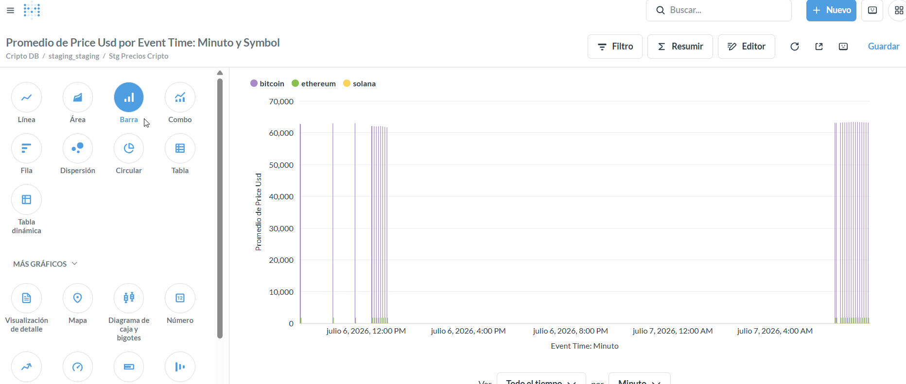
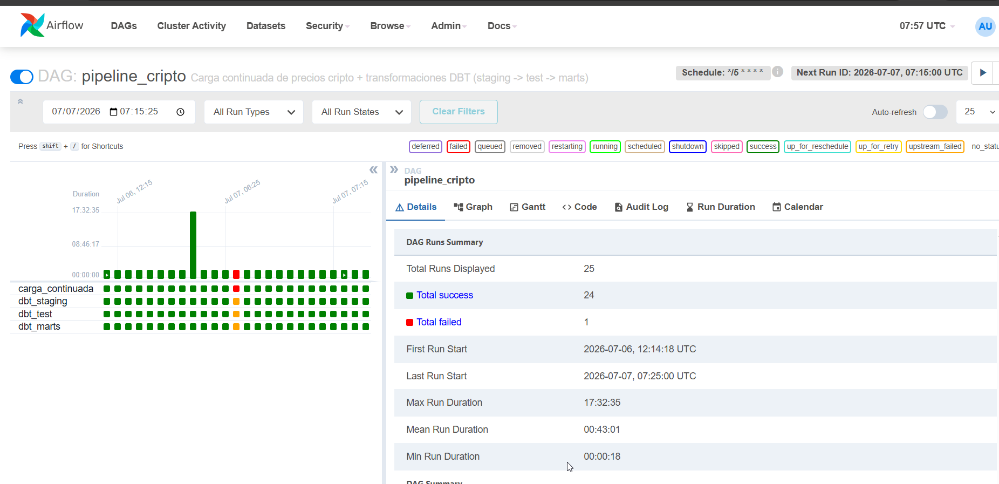

# Proyecto Cripto Docker

Pipeline de datos completo para ingesta, transformación, orquestación y visualización de precios de criptomonedas (Bitcoin, Ethereum y Solana), usando Docker Compose.

## Arquitectura

El proyecto está dividido en tres fases, todas orquestadas mediante un único `docker-compose.yml` sobre una red compartida `datanet`:

- **Fase 1 — Ingesta:** contenedor Python que consulta la API de CoinGecko y carga los precios en la capa `RAW` de PostgreSQL (`primera_carga.py` para la carga inicial, `carga_continuada.py` para cargas incrementales).
- **Fase 2 — Transformación (DBT):** transforma los datos de `RAW` a una capa `staging` (vistas, un registro por carga) y una capa `marts` (tablas agregadas: promedio, máximo y mínimo por moneda).
- **Fase 3 — Orquestación (Airflow):** DAG que encadena `carga_continuada → dbt_staging → dbt_test → dbt_marts` mediante `BashOperator`.
- **Visualización (Metabase):** dashboards sobre la capa `marts` y consultas directas sobre `staging` para ver la evolución de precios por carga.

## Servicios

| Servicio   | Descripción                          | Puerto local |
|------------|---------------------------------------|--------------|
| postgres   | Base de datos (RAW, staging, marts)  | 5433         |
| ingesta    | Jobs Python de carga de datos         | —            |
| adminer    | Cliente web para PostgreSQL           | 8080         |
| dbt        | Transformaciones + `dbt docs serve`   | 8080*        |
| airflow    | Orquestación del pipeline             | 8082         |
| metabase   | Dashboards y visualización            | 8083         |

\* Adminer y `dbt docs` comparten el puerto 8080; se alternan según cuál se esté usando en cada momento.

## Puesta en marcha

```bash
git clone https://github.com/franciscofdzfer/proyecto-cripto-docker.git
cd proyecto-cripto-docker
cp .env.example .env   # completar con tus propias credenciales
docker compose up -d
```

## Visualización en Metabase

Sobre la capa `staging.stg_precios_cripto` se puede construir una gráfica temporal con la evolución de las 3 monedas, agrupando por `symbol` y usando `event_time` como eje temporal:



## Orquestación con Airflow

El DAG ejecuta las 4 tareas del pipeline en orden, con reintentos automáticos y healthchecks entre servicios:



## Documentación del modelo de datos (dbt docs)

*(Pendiente: añadir captura de `dbt docs serve` en `docs/images/dbt_docs.png` y descomentar la línea de abajo)*

<!--  -->

## Estructura del repositorio

```
.
├── docker-compose.yml
├── .env.example
├── app/                  # Código Python de ingesta
├── postgres/
│   └── init/             # Script de inicialización de esquemas y tablas
├── dbt/                  # Modelos, sources y tests de dbt
├── airflow/              # DAGs de Airflow
└── docs/
    └── images/           # Capturas usadas en este README
```

## Autor

Francisco Fernández — proyecto desarrollado como parte de la asignatura de Data Engineering.
